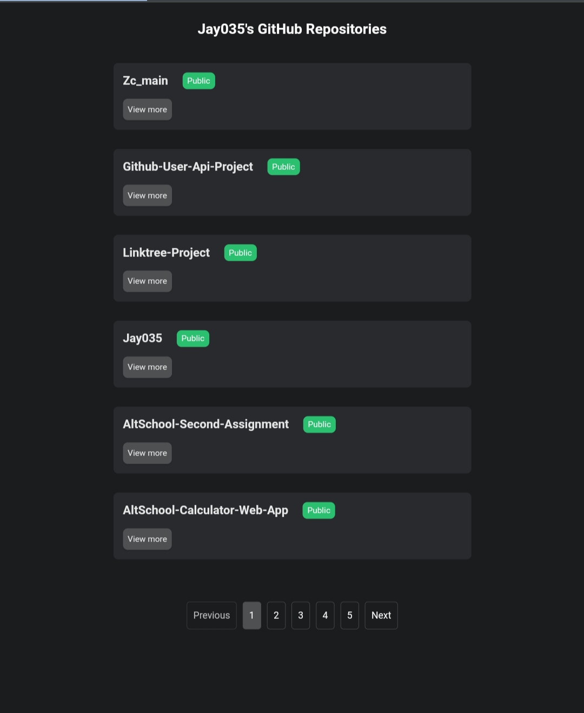

# AltSchool Exam Project
[Click here to view the live site](http://github-user-api-project.vercel.app/)

## Screenshot

## Technologies used

- [Tailwind CSS](https://tailwindCSS.com)
- [React JS](https://reactjs.org/)
- [React-paginate]()
- [AOS On Scroll Animation Library](https://michalsnik.github.io/aos/)

## Developer Info

- [Website](https://codexjay.vercel.app)
- [Twitter](https://twitter.com/Chibuike035)
- [LinkedIn](https://www.linkedin.com/in/chibuike-ukandu-8385401b0/)
